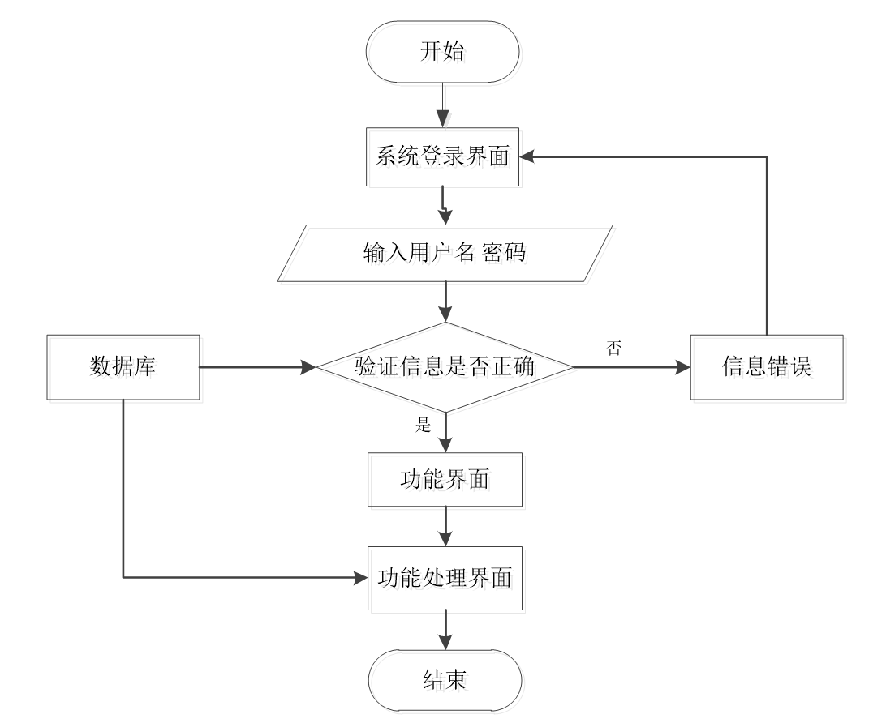
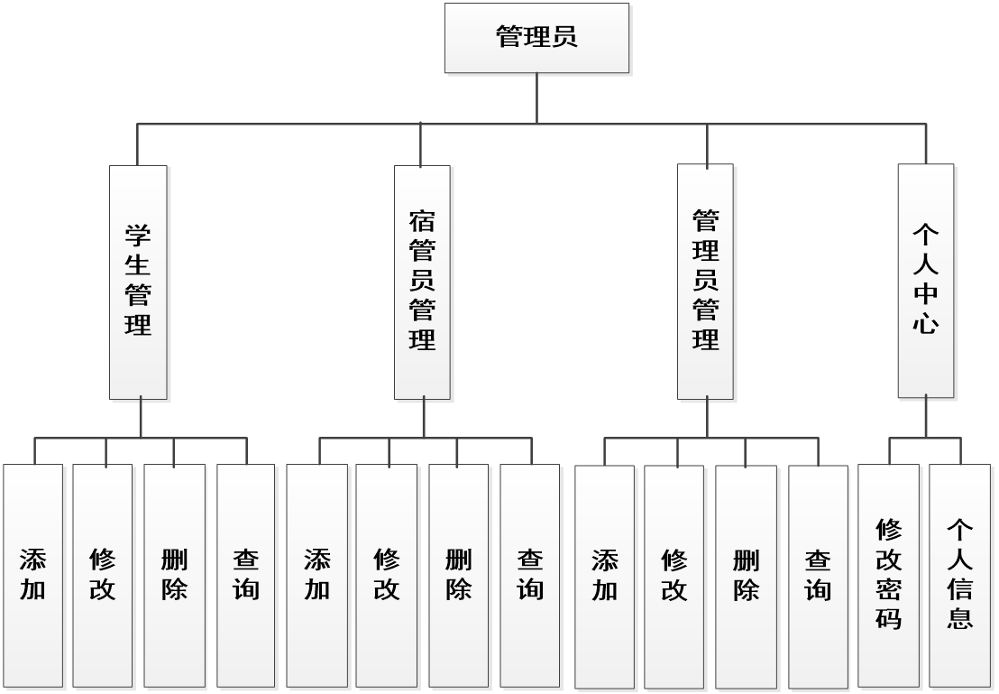
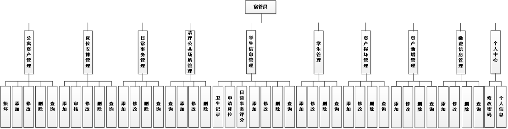
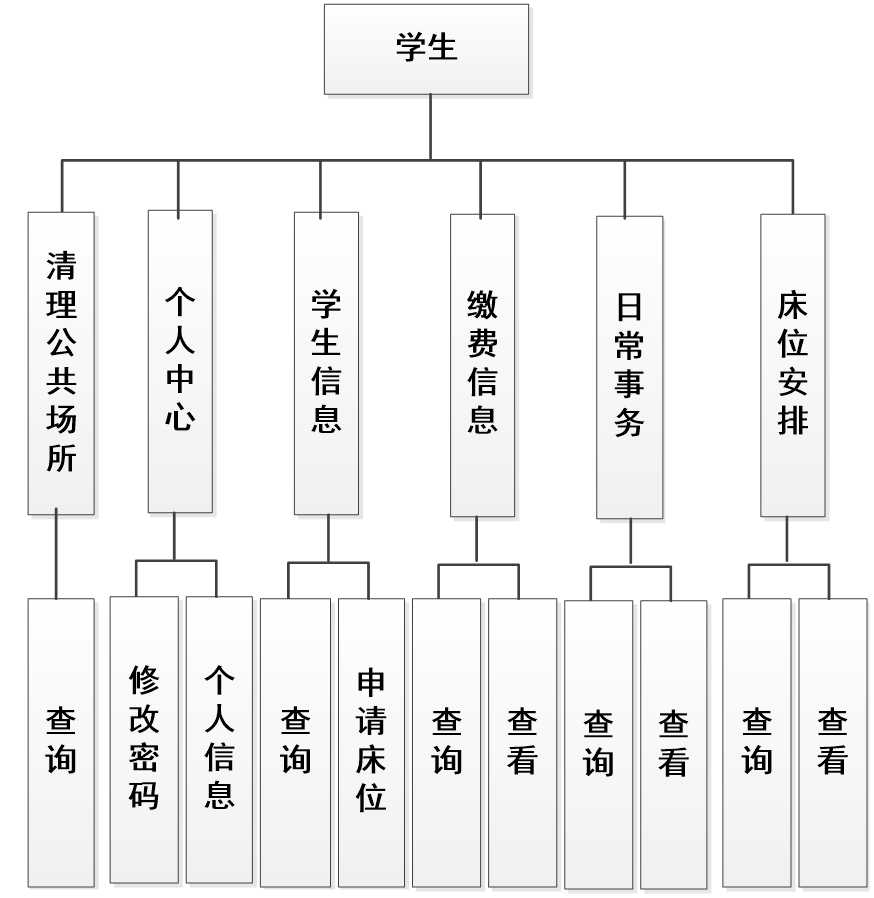
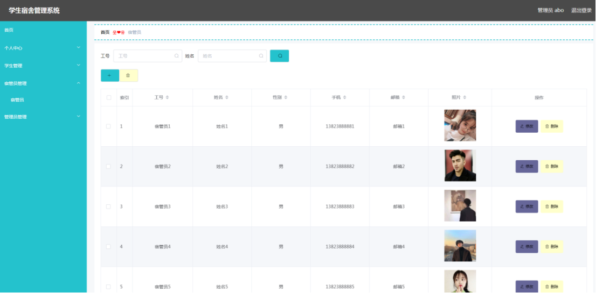
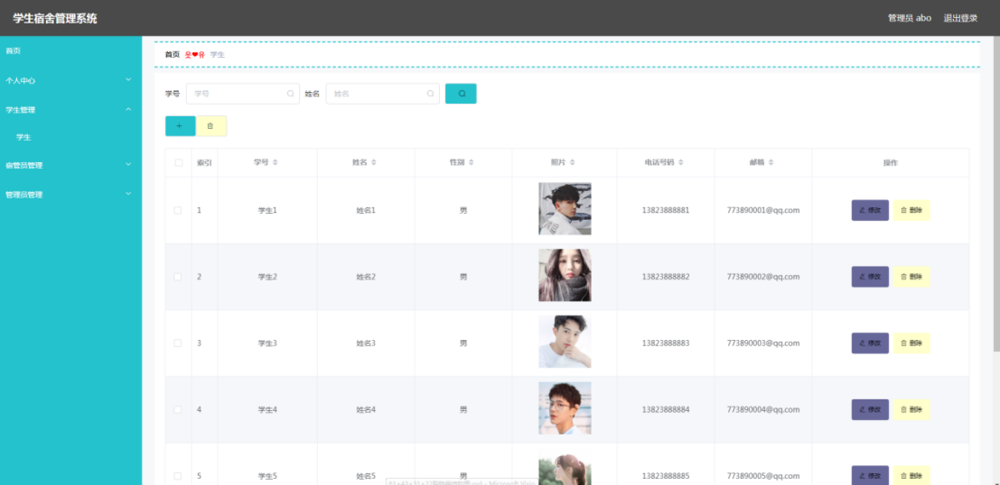
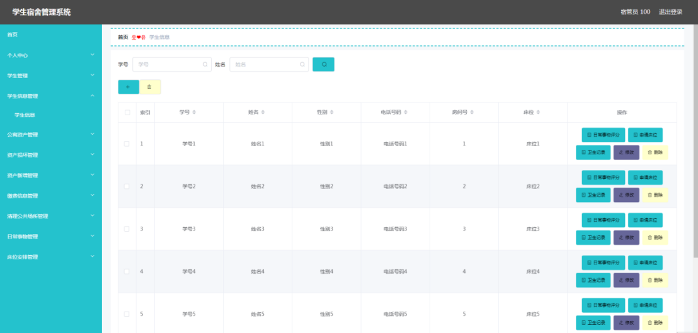
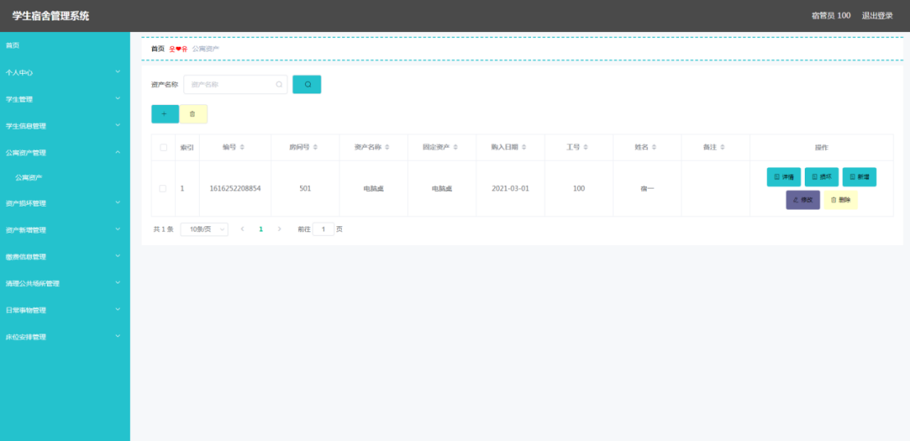
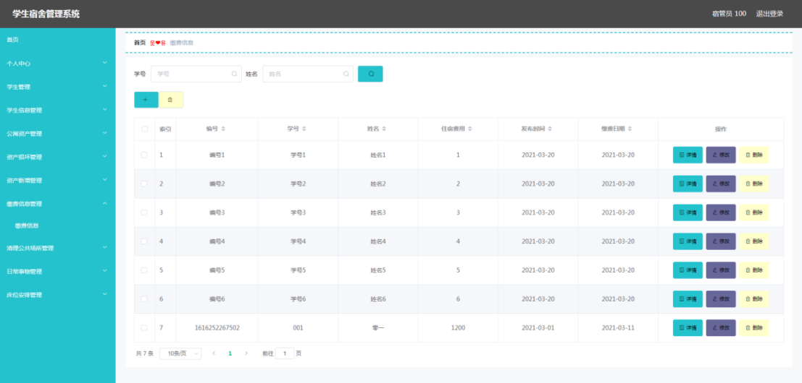
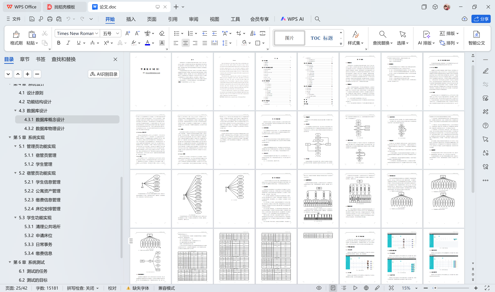

# springboot023-学生宿舍管理系统的设计与开发

>  博主介绍：
>  Hey，我是程序员Chaers，一个专注于计算机领域的程序员
>  十年大厂程序员全栈开发‍ 日常分享项目经验 解决技术难题与技术推荐 承接各类网站设计，小程序开发，毕设等。
>  【计算机专业课程设计，毕业设计项目，Java，微信小程序，安卓APP都可以做，不仅仅是计算机专业，其它专业都可以】

## 3000套系统可挑选，获取链接：https://chaerspol.github.io/

<b>QQ【获取完整源码】：674456564</b>

<b>QQ群【获取完整源码】：1058861570</b>

### 系统架构

> 前端：html | js | css | jquery | vue
>
> 后端：springboot | mybatis
> 
> 环境：jdk1.8+ | mysql | maven

# 一、内容包括
包括有  项目源码+项目论文+数据库源码+答辩ppt+远程调试成功

# 二、运行环境

> jdk版本：1.8 及以上； ide工具：IDEA； 数据库: mysql5.7及以上；编程语言: Java

# 三、需求分析

**3.1 可行性分析**

在正式对需要建设的项目进行投资前，有一个比较关键的步骤是不能缺少的，那就是可行性分析。它主要从当前技术，经济等角度去评估系统的可行性，在投资决策中常常采用这种科学的方法来论证项目。

**3.1.1 技术可行性**

当前，系统开发的技术已经发展成熟，而且通过计算机网络可以获取开发工具的使用方法，以及规范化编写的模块化代码，这些知识可以帮助开发者顺利完成本系统的编码工作。

**3.1.2 经济可行性**

本系统开发期间需要配置的软件环境，可以免费通过开发类官网下载安装，需要配置的硬件设备也不需要具备很高的性能，通常网吧电脑，或学校计算机机房的电脑都符合要求。因此，从经济方面考虑，学生宿舍管理系统开发可行。

**3.1.3 操作可行性**

学生宿舍管理系统根据用户使用习惯进行开发，设计的界面具有统一性，并具备优秀的导航功能。所以，只要会简单操作电脑的人员，可以无压力操作学生宿舍管理系统。
总之，从上述的论证来看，本系统可以开发。

**3.2 系统流程**

流程图这样的工具可以直观反映出系统内部的操作逻辑，可以帮助用户更好的理解系统。
进入本系统需要访问者提供验证信息。验证合格的访问者才能获取访问资格。其具体的操作流程见下图。访问者根据登录界面设置的信息项如实填写，待信息通过验证后，访问者可以进入指定的页面享受本系统提供的服务和阅读本系统的相关信息。

# 四、功能模块

在前面分析的管理员功能的基础上，进行接下来的设计工作，最终展示设计的管理员结构图（见下图）。管理员管理宿管员，管理学生，修改密码，维护个人信息。

在前面分析的宿管员功能的基础上，进行接下来的设计工作，最终展示设计的宿管员结构图（见下图）。宿管员管理公寓资产，缴费信息，公共场所清理信息，日常事务信息，审核学生床位安排信息。

在前面分析的学生功能的基础上，进行接下来的设计工作，最终展示设计的学生结构图（见下图）。学生查看公共场所清理信息，日常事务，缴费信息，在线申请床位，查看床位安排。

# 五、部分效果图展示

图5.1 宿管员管理页面【管理员进入指定功能操作区之后可以管理宿管员。其页面见下图。宿管员的资料需要管理员负责管理，包括修改，新增，删除等操作】

图5.2 学生管理页面【管理员进入指定功能操作区之后可以管理学生。其页面见下图。学生信息也需要管理员负责管理，包括信息的增删改查操作】

图5.3 学生信息管理页面【宿管员进入指定功能操作区之后可以管理学生信息。其页面见下图。宿管员增删改查学生信息，为各位学生申请床位，管理学生的卫生记录和日常事务评分】

图5.4 公寓资产管理页面【宿管员进入指定功能操作区之后可以管理公寓资产。其页面见下图。公寓资产存在损坏情况，需要宿管员通过损坏按钮登记公寓资产损坏信息】

图5.5 缴费信息管理页面【宿管员进入指定功能操作区之后可以管理缴费信息。其页面见下图。宿管员增删改缴费信息】

 <b>完整文章</b>
 

 

## 3000套系统可挑选，获取链接：https://chaerspol.github.io/

<b>QQ【获取完整源码】：674456564</b>

<b>QQ群【获取完整源码】：1058861570</b>

